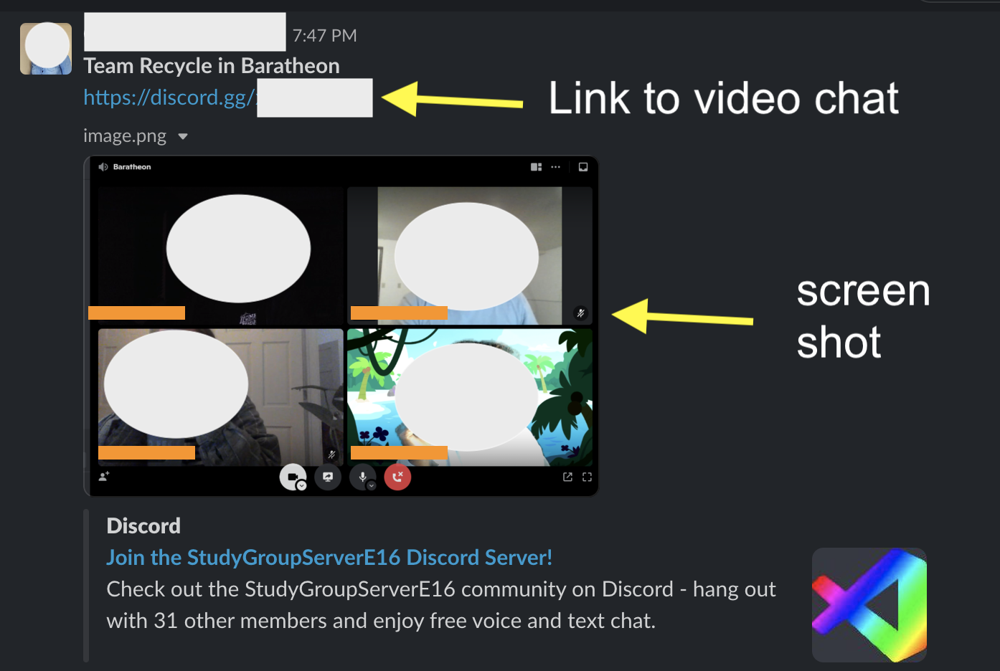

Each week you will have study groups. They are 3 hour blocks. Your study group day must be on either Wednesday or Thursday. If your group would like to meet again after the 3 hour session, that day is up to your team. You will determine the time and location (virtual is the default unless the ENTIRE team agrees otherwise), but the instructional team still needs a link to be able to join you virtually if we chose to do so.

Post the link to your session EVERY WEEK as well as a screenshot or image of the entire team together in the cohort slack channel.

See example below:

